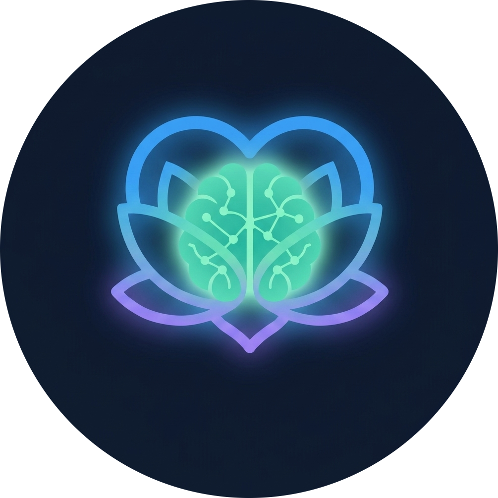

# 🌊 Serenity AI: The Future of Empathetic Wellness

<div align="center">
  
  
  ### *Where Digital Art Meets Mental Wellness*
  
  [](https://reactjs.org/)
  [](https://www.typescriptlang.org/)
  [](https://threejs.org/)
  [](https://ai.google.dev/)

  **"The world doesn't need another chatbot. It needs a companion that listens, reacts, and cares."**

  **Get Started Here**: https:// <placeholder>
</div>

---

## 💎 Our North Star: The USP
In an era of "AI-Slop", where generic wellness apps are vibe-coded in an afternoon... **Serenity AI** stands apart. 

While others offer static text boxes, we offer **Amy**. 

Amy is not just a language model; she is a **Live 3D Companion** rendered in real-time. She doesn't just process your words, she reacts to your emotions with Natural expressions, playful blushing, and a voice that feels human. While the "standard" features of our platform (tracking, assessments, resources) are built for a complete experience, our **Live Avatar Chat** is the technological soul that defines Serenity AI.

---

## 🌟 Key Features

### 🎨 The Crown Jewel: Amy (Live AI Companion)
Experience wellness through a **Live 3D Avatar (VRM)** powered by Google Gemini and Three.js.
- **Emotion Recognition**: Amy detects the sentiment of your voice and text, reacting with dynamic facial blendshapes (happy, shy, frustrated, teasing).
- **Proactive Empathy**: She giggles at your jokes, blushes at compliments, and offers a warm, playful presence.
- **Barge-in Support**: Use the WebSocket-powered Mic mode for natural, bidirectional conversations where you can speak and be heard instantly.

### 🪜 The Progressive Trust Ladder
A unique safety-first architecture designed to protect vulnerable users.
- **Phase 1 (AI-Only)**: Build trust in a private, judgment-free space with Amy.
- **Phase 2 (Micro-Therapy)**: Unlock curated resources once you're ready.
- **Phase 3 (Observation)**: Safely view community interactions.
- **Phase 4 (Full Access)**: Contribute to a community that has proven its readiness.

### 🧠 Sentiscope & Smart Triage
- **Mood Assessment**: A 5-question logic-driven evaluation of your mental state.
- **AI Recommendation Engine**: Gemini-powered analysis that maps your mood to specific therapy exercises (Audio, Physical, or Reading).
- **Crisis Detection**: Instant "Crisis Popups" and safety banners if severe distress is detected, providing immediate resources.

---

## 🛡️ Ethical Safety
- **Guardian Consent**: Mandatory email verification for users under 18.
- **Real-Time Toxicity Filtering**: A 3-tier moderation system that prevents harmful content from reaching the community.
- **Data Privacy**: End-to-end encryption for AI conversations and secure MongoDB Atlas storage.

---

## 🎭 Multi-Modal Therapy Suites
- **Laughing Therapy**: A randomized meme engine and curated stand-up comedy grid to boost endorphins.
- **Audio Therapy**: Integrated Spotify recommendations, motivational podcasts, and audiobooks.
- **Physical Therapy**: Yoga instructions, cardio guides, and 4-7-8 breathing exercises.
- **Reading Therapy**: Expert-curated mental health literature.

---

## 🛠️ The Tech Behind the Magic

- **The Brain**: Gemini 2.5 Flash for low-latency, empathetic reasoning.
- **The Voice**: Real-time Bidirectional WebSockets for seamless "Barge-in" conversations.
- **The Body**: VRM Models + Three.js + GSAP for fluid, expressive 3D character animation.
- **The Backbone**: Node.js/Express + MongoDB Atlas for a scalable, secure backend.
- **The Interface**: React 18 + Tailwind CSS + Framer Motion for a premium, glassmorphic UI.

---

## 🚀 Quick Start
1. **Clone & Install**: `npm install`
2. **Environment**: Rename `.env.example` to `.env` and add your `API_KEY`.
3. **Launch**: `node server/server.js` and `npm run dev`.

---

## 🚀 Vision
We didn't build Serenity AI to win a hackathon. We built it to solve the isolation problem. By combining **Progressive Trust** with **Empathic AI Art**, we’ve created a platform where users don't just "use" a tool; they "visit" a friend.

---

## 📂 Project Structure

```
serenity-ai/
├── src/
│   ├── components/       # UI building blocks
│   │   ├── Mascot/       # Amy's 3D core & animation system
│   │   ├── ReadinessMeter.tsx
│   │   └── ...
│   ├── pages/            # View layers & routing logic
│   ├── features/         # Specialized AI & voice utilities (WebSockets)
│   ├── context/          # Global state (Auth/Wellness)
│   └── imgs/             # Visual assets & memes
├── server/
│   └── server.js         # Express + MongoDB + AI Proxy
├── public/               # Static models & logos
└── config/               # Tailwind, Vite, & TS configs
```

---

## 📧 Connect & Support

**Team Name**: The A Team  
**Platform**: [Serenity AI Official](https://github.com/Kart-0010-0101)

---

<div align="center">
  <i>Cultivating trust before exposure, promoting growth before risk.</i>
</div>
